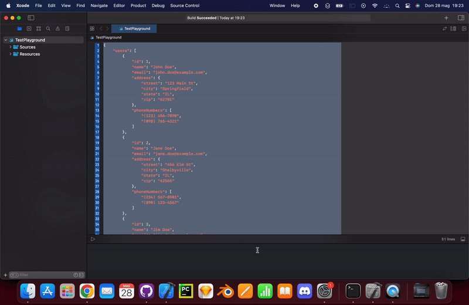

# XcodeLovesAI

An Xcode Source Editor Extension to integrate ChatGPT in Xcode and let the AI assist you within Xcode by generating comments, Codable models from JSON, generate code from instructions, etc...

## Installation

1. Open the Xcode project
2. Enable the signing in both the application target and the Source Code Extension target from the project inspector
3. Select the extension scheme then run Product => Archive
4. Right click on the generated archive => Show in Finder
5. Right click on the archive => Show Package Contents
6. Drag the .app file to your Application folder
7. Run the application then exit from it.
8. Go to System Preferences => Extensions => Xcode Source Editor and check that the extension is enabled.
9. Run Xcode and select a source file or any file that opens within the source editor. The extension's commands should be available at the end of the Editor menu, under the menu item "AIAssistant".

Important: before trying the extension you must obtain an OpenAI apikey (https://platform.openai.com/account/api-keys), then create a file named openai.apikey XCLovesAI_Extension folder and paste the apikey inside.
 
## Code Use Disclosure

By using this extension, you agree that any code you input will be sent to the OpenAI's ChatGPT APIs. Do not submit code that contains sensitive intellectual property or sensitive data (api keys, passwords, etc...). The responsibility of ensuring this rests with you. Misuse of this tool is solely the user's liability.

## Available Commands

### Code Documentation

This command generates the code documentation for the selected code.

In the following example I'm generating the documentation for a sample class taken from a public github repo:


### Generate Codable from JSON

Paste the json code in the source editor, select it and launch this command to generate a swift codable for the selected JSON.

In the following example I'm using the Generate Codable from JSON on the selected JSON to let ChatGPT generate Swift Codable models from the JSON:



### Instructions2Code

This commands will let the AI to generate code based on your comments. Open a new source file, type in comments to describe the behaviour of the code you want to be generated, select it then launch the command. After the code is generated you can add more comments to improve the code or add more code by selecting all the code including the comments, then relaunching the command.

In the example below I add a comment above a function which make an api call and return the result using completions, and instruct ChatGPT to rewrite this function using async/await instead:


In the following example I ask to generate the code documentation for the selected class:


## Contribute

You are welcomed to contribute to XcodeLovesAI ChatGPT extension by creating new commands or improving the existing one. Adding new commands is very easy, just create a new command class inside the XCLovesAI_Extension/Commands group folder (see how the existing commands class are done for reference), then add a new dictionary entry in the XCLovesAI_Extension/Info.plist like the following one:

```
    <dict>
        <key>XCSourceEditorCommandClassName</key>
        <string>$(PRODUCT_MODULE_NAME).CommandClassName</string>
        <key>XCSourceEditorCommandIdentifier</key>
        <string>$(PRODUCT_BUNDLE_IDENTIFIER).CommandClassIdentifier</string>
        <key>XCSourceEditorCommandName</key>
        <string>Command Name</string>
    </dict>
```

Replacing CommandClassName with the name of the class you have created for this command, CommandClassIdentifier with an identifier for this command (can be the same as CommandClassName) and Command Name to the name you want to show in the corresponding menu item.
    
### Testing the extension while contributing
    
To test the extension while you are contributing with your code, select the extension target then Run. A dialog will ask you to select an application, choose Xcode. A new Xcode instance with a grayed icon will open, you can test the extension there from the Editor menu.

## Contact Me

You can contact me at siino.marco /at/ gmail dot com
